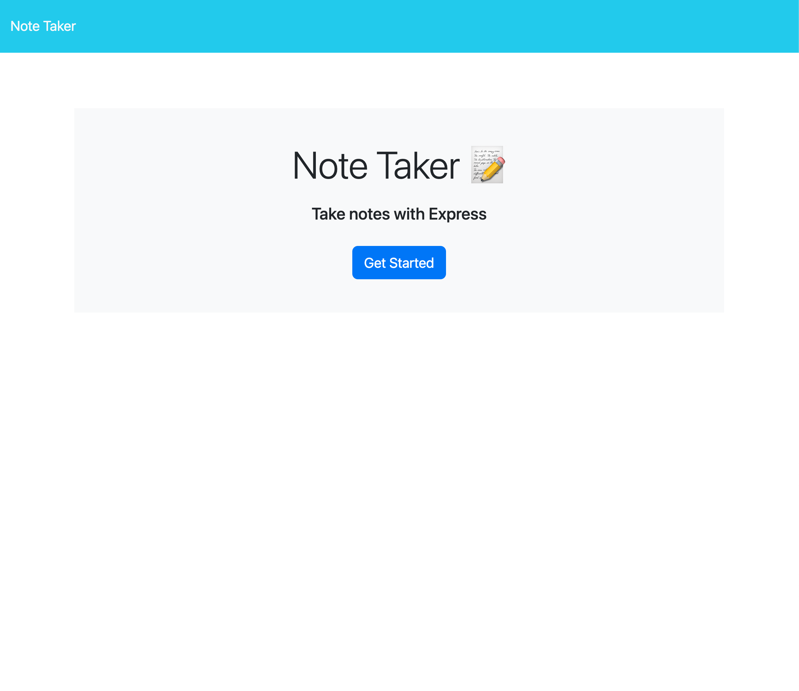
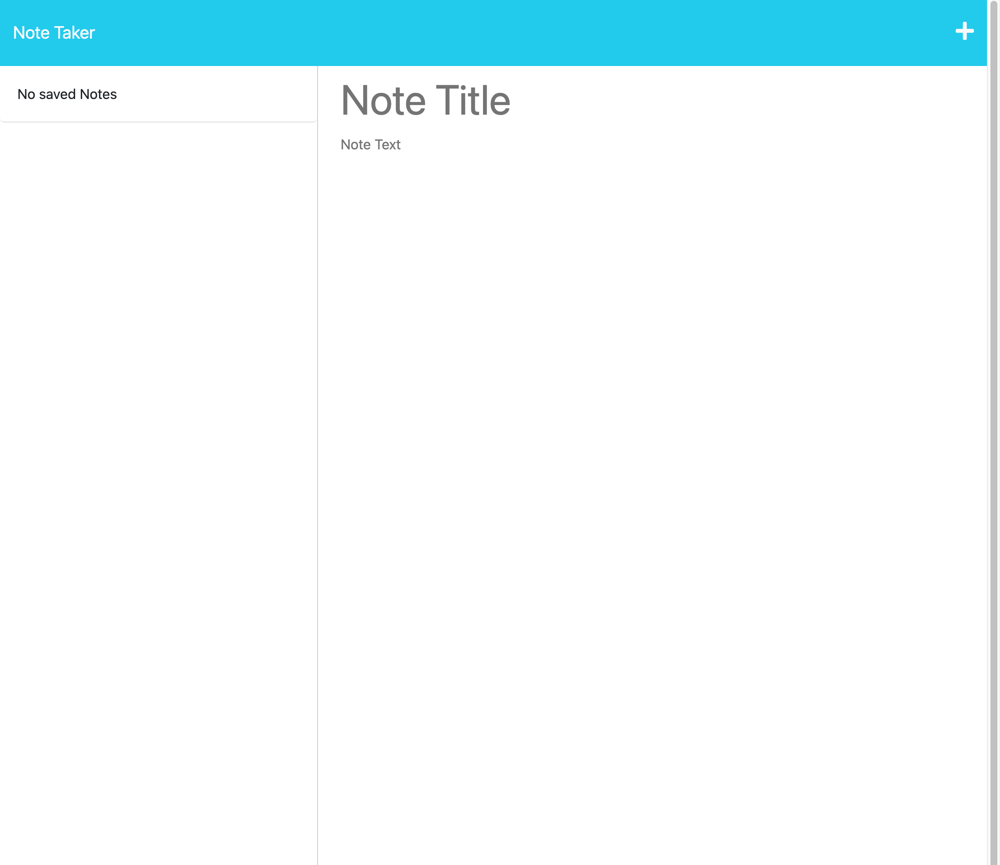

# <Note-Taker>

## Description

This note taker project was focused on having a better understanding of express.js. It helped also utilize past skills learnt such as fs write and read as well as understanding how to display and read parsed and non-parsed objects. It helped refine my understanding of how the back end interacts with the front end, especially when learning take input, display it and and also retrieve or delete it. 

## Installation

If you wish to run this project on your own personal computer simply clone this repository and open it within VS Code. Once done npm install in the intergrated terminal and then proceed to run npm start in the terminal. A link should appear, once clicked it will take you to the live site on your own personal PORT. 

## Usage

Link to the project: 

